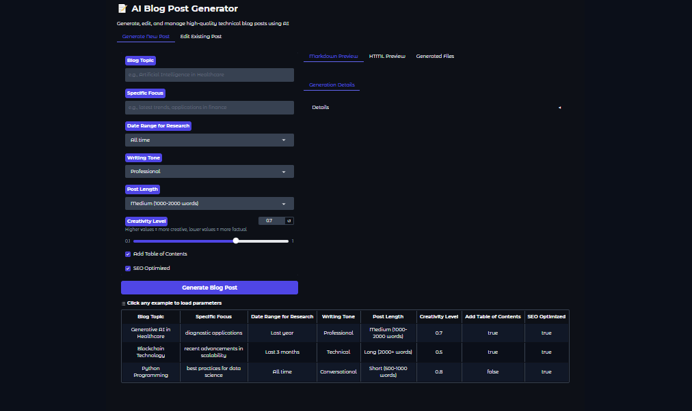
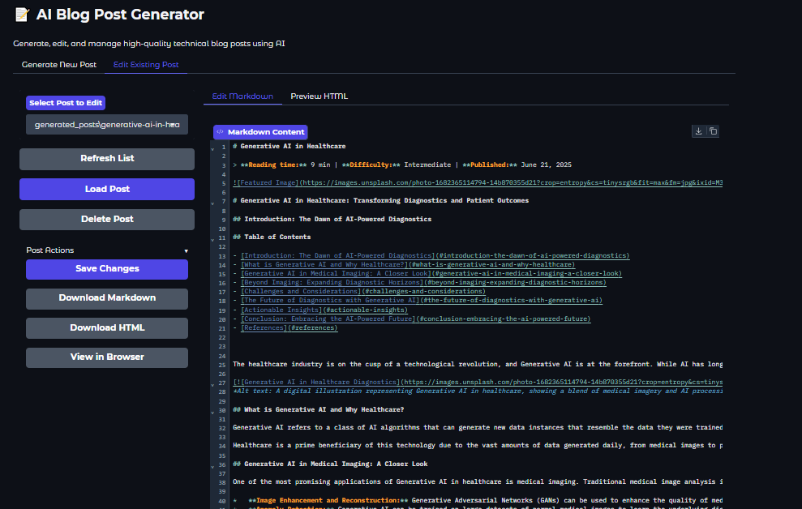
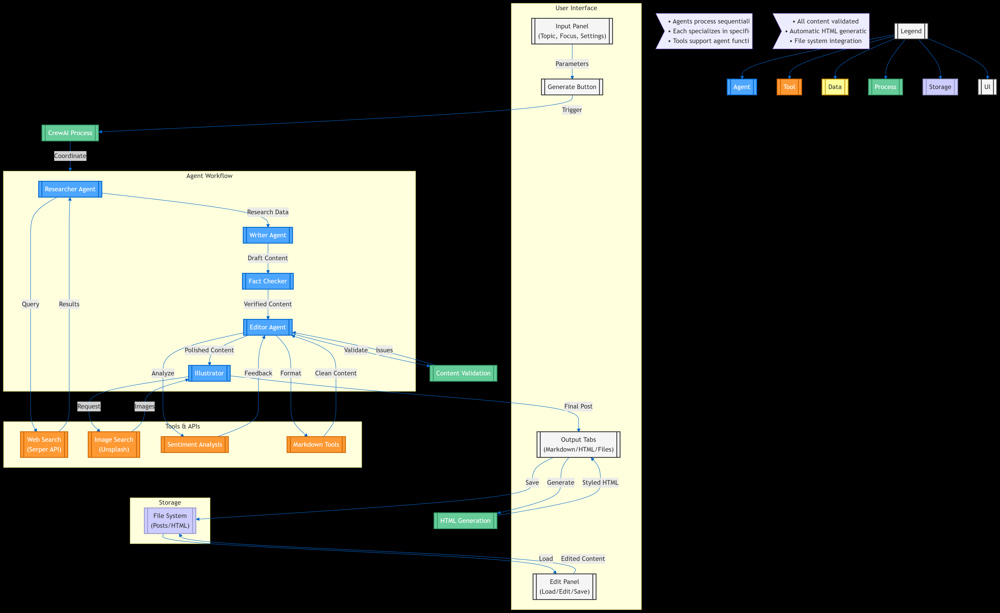

# AI Blog Post Generator using Multi-AI-Agent System 🤖✍️

------

## 📹 Demo Video

[](https://drive.google.com/file/d/19LwnnJM4tVmA7IpMq6RYk8yOg2y4Z4-G/view)

> Click the image above to watch a quick demo of the AI Blog Generator!


<video controls width="600">
  <source src="video/ai_blog_genarator.mp4" type="video/mp4">
</video>
An advanced AI-powered tool that generates, edits, and publishes high-quality technical blog posts across multiple platforms.

## 🌟 Features

### Core Capabilities
- **Multi-Agent System** (Researcher, Writer, Editor, Illustrator, Fact Checker)
- **Multi-Platform Publishing** (Medium, WordPress)
- **Multi-Model Support** (Currently supports Gemini, with plans to add OpenAI, Claude, Ollama, and OpenSource Models)
- **Customizable Content** (Tone, length, focus area, creativity level)

### Content Generation
- **Research Integration** (Web search with date filtering)
- **Visual Content** (Unsplash integration with plans for diagram generation)
- **Multi-Format Output** (Markdown, HTML)
- **SEO Optimization** (Auto meta tags, keyword optimization)
- **Sentiment Analysis** (Tone consistency checks)

## 🛠️ Technology Stack

| Component               | Technology                          |
|-------------------------|-------------------------------------|
| **Backend**            | Python 3.10+                        |
| **Web Interface**      | Gradio                              |
| **AI Orchestration**   | CrewAI                              |
| **LLM Providers**      | Gemini (current), others planned    |
| **Content Formatting** | Markdown, HTML, CSS                 |
| **NLP**                | NLTK (Sentiment analysis)           |
| **APIs**               | Serper (Search), Unsplash (Images)  |

## 📦 Installation

### Prerequisites
- Python 3.10+
- Git
- API keys for desired services

### Setup
```bash
# Clone repository
git clone https://github.com/shaikh-vasim/ai-blog-generator.git
cd ai-blog-generator

# Create virtual environment
python -m venv venv
source venv/bin/activate  # Linux/Mac
.\venv\Scripts\activate   # Windows

# Install dependencies
pip install -r requirements.txt

# Set up environment variables
cp .env.example .env
# Edit .env with your API keys
```

## 🚀 Usage

### Running the Application
```bash
python app.py
```
Access the interface at `http://localhost:7860`

### Generating a Blog Post
1. Navigate to the "Generate New Post" tab
2. Enter your topic and optional focus area
3. Adjust parameters (tone, length, date range, etc.)
4. Click "Generate Blog Post"
5. View and download the generated content

### Editing Existing Posts
1. Navigate to the "Edit Existing Post" tab
2. Select a post from the dropdown
3. Click "Load Post"
4. Make your edits in the markdown editor
5. Click "Save Changes" when finished

## 🌐 API Integration

The application currently integrates with:

1. **Google Gemini API** - For AI content generation
2. **Serper API** - For web search functionality
3. **Unsplash API** - For image search and inclusion

Future integrations planned with:
- OpenAI
- Claude
- Ollama
- Additional publishing platforms

### Interface Examples

**Example 1: Generation Interface**


**Example 2: Publishing Options**


------
## 📂  Output Example: Output

----
## 🏗️ System Architecture


## 🔄 Complete Workflow

1. **Input Phase**:
   - User specifies topic/parameters
   - System validates requirements

2. **Research Phase**:
   - Web search with date filters
   - Source evaluation
   - Citation generation

3. **Drafting Phase**:
   - LLM generates initial content
   - Adds code snippets/examples
   - Structures with headings

4. **Quality Phase**:
   - Fact checking
   - Sentiment analysis
   - SEO optimization

5. **Publishing Phase**:
   - Platform-specific formatting
   - Metadata generation
   - API publishing or export

## 📂 File Structure

```
ai-blog-generator/
├── app.py                     # Main application
├── blog_generator/            # Core modules
│   ├── agents.py              # AI agent definitions
│   └── utils.py               # Helper functions
├── generated_posts/           # Blog post outputs
├── static/                    # Static assets
├── screenshots/               # UI examples
├── requirements.txt           # Dependencies
├── .env.example               # Environment template
├── LICENSE                    # MIT License
└── README.md                  # This file
```

## ⚙️ Configuration

Customize the application through:

1. **Environment Variables** (in `.env` file):
   - `GOOGLE_API_KEY`: For Gemini AI access
   - `SERPER_API_KEY`: For web search functionality
   - `UNSPLASH_ACCESS_KEY`: For image search

2. **Code Configuration**:
   - Modify `BlogPostGenerator` class for default behaviors
   - Adjust Gradio UI in `create_ui()` function

## 🤖 Agent Descriptions

### Researcher Agent
- **Role**: Senior Research Analyst
- **Responsibilities**:
  - Find and analyze latest information
  - Verify sources
  - Provide citations and references

### Writer Agent
- **Role**: Tech Content Writer
- **Responsibilities**:
  - Create engaging, structured content
  - Explain complex concepts simply
  - Include examples and code snippets

### Editor Agent
- **Role**: Senior Editor
- **Responsibilities**:
  - Ensure high quality and accuracy
  - Improve clarity and flow
  - Verify technical correctness

### Illustrator Agent
- **Role**: Content Illustrator
- **Responsibilities**:
  - Find appropriate visuals
  - Generate proper markdown formatting
  - Ensure accessibility with alt text

### Fact Checker Agent
- **Role**: Technical Fact Checker
- **Responsibilities**:
  - Verify all technical claims
  - Check dates and statistics
  - Flag potential inaccuracies

## 📝 Example Use Cases

1. **Technical Blogging**:
   - Generate in-depth articles on AI/ML topics
   - Create tutorials with code examples

2. **Content Marketing**:
   - Produce SEO-optimized articles
   - Maintain consistent content pipeline

3. **Education**:
   - Create learning materials
   - Generate explainers on complex topics

4. **Documentation**:
   - Produce technical documentation
   - Create how-to guides

--------------------------------
## 🛡️ Limitations & Important Disclaimer

### ⚠️ Critical Notice for All Users
   **Please remember:** When using this application to generate blog posts, you **must** validate and review all content thoroughly before publishing or sharing. 

   **Key reasons why verification is essential:**
   1. **AI Imperfections**: This app uses AI systems that may occasionally:
      - Hallucinate or invent inaccurate information
      - Generate plausible-sounding but incorrect technical details
      - Provide outdated or unverified claims

   2. **Responsibility**: You remain fully responsible for all content published under your name

   3. **Quality Control**: AI-generated content often benefits from human refinement for:
      - Tone adjustment
      - Accuracy verification
      - Personalization

   4. **Ethical Responsibility**: 
      - Always ensure content respects intellectual property rights
      - Verify facts, especially for technical/medical/legal topics
      - Maintain human oversight for quality and accuracy

   5. **Creator Intent**: 
      - This tool is designed **only** to assist content creators by:
      - Providing draft content for refinement
      - Offering research assistance
      - Increasing productivity through AI collaboration
      - **Not** intended to replace human creativity or judgment

   ### **Ethical Usage Policy**
   This application is designed with two core purposes:
   1. **Productivity Enhancement Tool**:
      - For content creators to accelerate their workflow
      - To provide research assistance and draft generation
      - As a brainstorming aid for new content ideas
   2. **AI Capability Demonstration**:
      - Showcasing what current LLM technology can achieve
      - Serving as an educational resource about AI-assisted writing

   ### **Recommended Workflow**
   For ethical, high-quality results:
   1. Use generated content as a **first draft only**
   2. Always add:
      - Your unique perspective
      - Personal experiences/examples
      - Manual fact-checking
   3. Consider AI output as:
      - Research starting points
      - Structure suggestions
      - Inspiration for original content

   ### For Content Creators:
   This application is specifically created to:
   - **Enhance productivity** in your content creation workflow
   - Provide **inspiration and research assistance**
   - Offer **time-saving drafts** that require your expert review
   - Help generate **reference materials** with proper verification

   Remember: **Your expertise + AI assistance = Best results**. The final content quality and authenticity depends on your human input and review.

--------------------------------


## 📈 Performance Considerations

1. **Caching**: Implemented for search results to reduce API calls
2. **Error Handling**: Robust error handling for API failures
3. **Validation**: Content validation for quality control
4. **Logging**: Comprehensive logging for debugging

## 🛡️ Limitations

1. **API Dependencies**: Requires external API keys for full functionality
2. **Content Quality**: May require human review for sensitive topics
3. **Image Selection**: Defaults to generic tech images when API fails
4. **Research Depth**: Limited by search API capabilities

## 📜 License

MIT License

Copyright (c) 2024 [Your Name]

Permission is hereby granted... [full license text in LICENSE file]

## 🤝 Contributing

We welcome contributions! Here's how:

1. **Report Bugs**: Open an issue with reproduction steps
2. **Suggest Features**: Open an issue with use cases
3. **Code Contributions**:
   ```bash
   # Fork and clone
   git clone https://github.com/shaikh-vasim/ai-blog-generator.git
   
   # Create feature branch
   git checkout -b feature/your-feature
   
   # Commit changes
   git commit -m "Add your feature"
   
   # Push and open PR
   git push origin feature/your-feature
   ```

### Contribution Areas Needed:
- Additional publishing platforms
- Local model optimizations
- UI enhancements
- Automated testing
